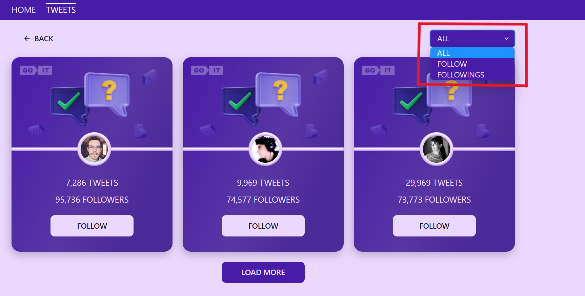

• Додаток імітує спрощену версію соціальної мережі, де користувач може
переглядати профілі інших людей і підписуватися на них. При цьому поточна
кількість підписок користувача відображається в його профілі на Головній
сторінці.

• На стороні інтерфейсу реалізована розбивка на сторінки та фільтрація списку
користувачів за категоріями «All», «Follow» та «Following».

• Відповідно до вимог проекту, як бекенд використовується сервіс mockapi.io, де
дані представлені масивом об’єктів з ключами: «id», «user», «avatar»,
«followers» і «tweets». ".
